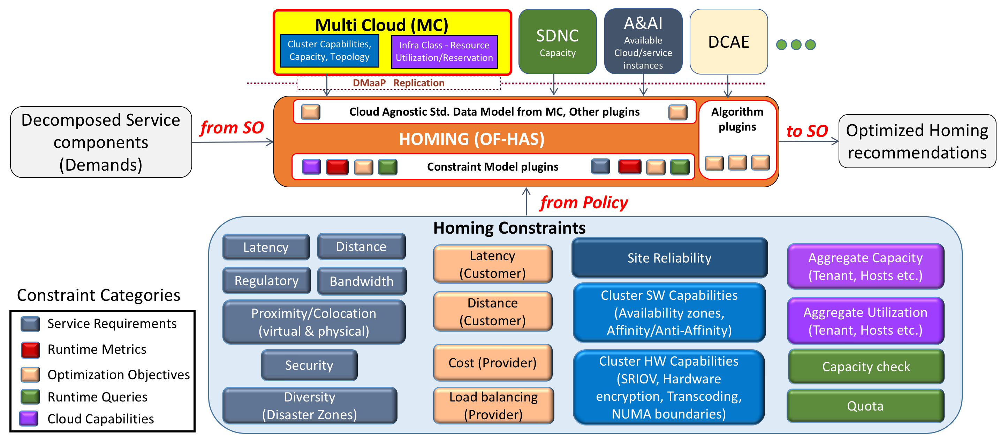
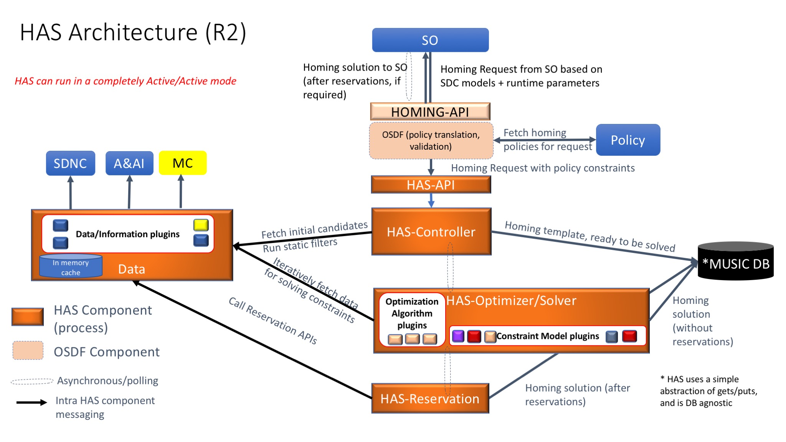
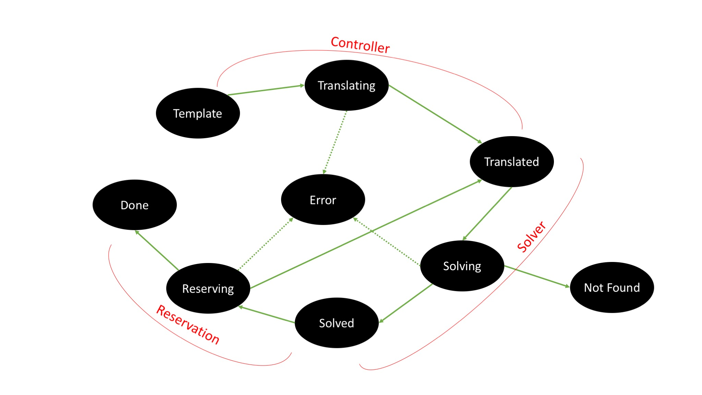
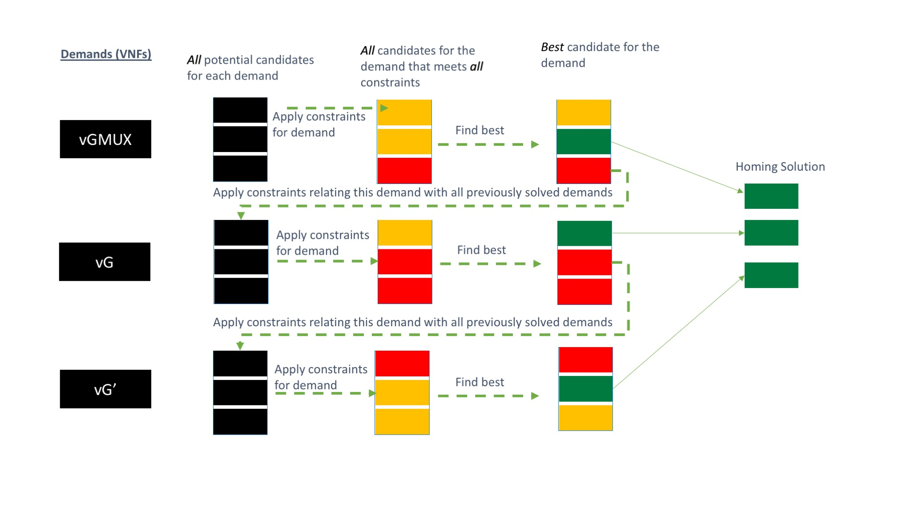

.. This work is licensed under a Creative Commons Attribution 4.0 International License.
.. _architecture:

Architecture
=============================================

Introduction
------------------
OOF-HAS is an policy-driven placement optimizing service (or homing service) that allows ONAP to deploy services
automatically across multiple sites and multiple clouds. It enables placement based on a wide variety of policy
constraints including capacity, location, platform capabilities, and other service specific constraints. In
Frankfurt release, it is also used for the E2E Network Slicing use case to select an appropriate existing Network
Slice Instance (NSI) / Network Slice Sub-net Instances (NSSIs), and/or provide the Slice Profile for creating a
new NSSI which shall be part of a new NSI.

HAS is a distributed resource broker that enables automated policy-driven optimized placement of services on a
global heterogeneous platform using ONAP. Given a set of service components (based on SO decomposition flows)
and requirements for placing these components (driven by policies), HAS finds optimal resources (cloud regions
or existing service instances) to home these service components such that it meets all the service requirements.
HAS is architected as an extensible homing service that can accommodate a growing set of homing objectives, policy
constraints, data sources and placement algorithms. It is also service-agnostic by design and can easily onboard
new services with minimal effort. Therefore, HAS naturally extends to a general policy-driven optimizing placement
platform for wider range of services, e.g., DCAE micro-services, ECOMP control loops, server capacity, etc.
Finally, HAS provides an traceable mechanism for what-if analysis which is critical for ease of understanding a
homing recommendation and resolving infeasibility scenarios.

HAS in Service Instantiation workflows
--------------------------------------------
Below is an illustration of HAS interactions with other ONAP components to enable Policy driven homing. The homing
policy constraints have been expanded (and categorized) to highlight the range of constraints that could be provided
to HAS for determining the homing solution. The figure also shows how HAS uses a plugin-based approach to allow an
extensible set of constraints and data models.

More information on how homing constraints are specified can be found at OOF-HAS Homing Specification Guide, and a
sample homing template has been drawn up for residential vCPE Homing Use Case.

HAS Architecture (R2)
----------------------

Lifecycle of a Homing request in HAS
--------------------------------------------

Use cases
----------------------
Residential vCPE: https://wiki.onap.org/display/DW/vCPE+Homing+Use+Case

5G RAN: https://wiki.onap.org/display/DW/Homing+5G+RAN+VNFs

E2E Network Slicing: https://wiki.onap.org/display/DW/E2E+Network+Slicing+Use+Case+in+R6+Frankfurt

A sample heuristic greedy algorithm of HAS (using a vCPE as example)
------------------------------------------------------------------------

